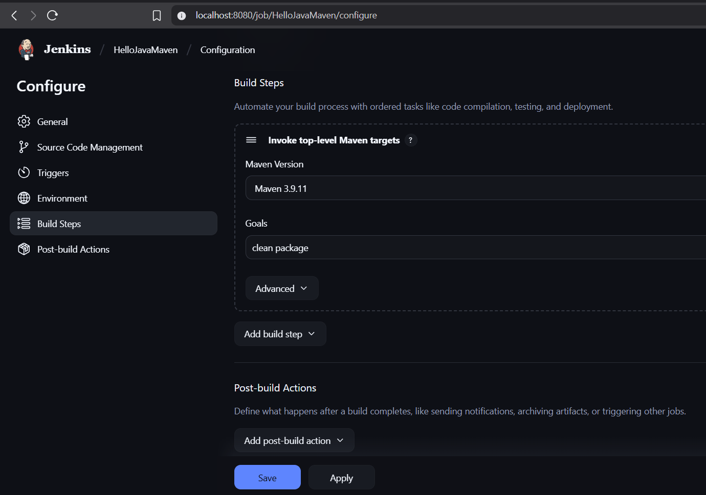

# 🚀 Java Maven CI/CD Pipeline using Jenkins

---

## 📌 Overview

This project demonstrates setting up a **complete automated CI/CD pipeline** for a simple Java Maven application using:

- **Jenkins** (running in Docker) for automation and build orchestration  
- **GitHub webhooks** to trigger Jenkins builds on every code push  
- **ngrok** to expose local Jenkins to the internet securely for receiving webhook requests
  
---

## 🛠️ Tech Stack & Tools

| Tool             | Purpose                                         |
| ---------------- | ----------------------------------------------- |
| **Java (JDK 8)** | Build the HelloWorld application                |
| **Maven**        | Compile, package, and manage Java dependencies  |
| **Jenkins**      | Automate the build process                      |
| **Docker**       | Run Jenkins in a container                      |
| **ngrok**        | Expose local Jenkins server for GitHub Webhooks |
| **GitHub**       | Host the source code and trigger Jenkins builds |

---

## 🧩 Project Structure

```bash
Java-mavenDevopsTask8/
├── pom.xml                  # Maven configuration (defines project, Java version, plugins, and packaging instructions)
└── src/
    └── main/
        └── java/
            └── HelloWorld.java  # Simple Java HelloWorld app
````

---

## ✅ Prerequisites

* Docker installed on your system
* Java JDK 8 or 11
* Maven installed OR configured in Jenkins
* GitHub account
* ngrok account (for tunneling local ports)

---

## 🚧 Step-by-Step Setup Guide

### 🔹 1. Create Java Project

**HelloWorld.java**

```java
public class HelloWorld {
    public static void main(String[] args) {
        System.out.println("Hello, Jenkins + Maven!");
    }
}
```

**pom.xml**

```xml
<project xmlns="http://maven.apache.org/POM/4.0.0"
         xmlns:xsi="http://www.w3.org/2001/XMLSchema-instance"
         xsi:schemaLocation="http://maven.apache.org/POM/4.0.0
                             http://maven.apache.org/xsd/maven-4.0.0.xsd">
    <modelVersion>4.0.0</modelVersion>
    <groupId>com.example</groupId>
    <artifactId>hello</artifactId>
    <version>1.0</version>

    <build>
        <plugins>
            <plugin>
                <groupId>org.apache.maven.plugins</groupId>
                <artifactId>maven-compiler-plugin</artifactId>
                <version>3.8.1</version>
                <configuration>
                    <source>1.8</source>
                    <target>1.8</target>
                </configuration>
            </plugin>
        </plugins>
    </build>
</project>
```

---

### 🔹 2. Start Jenkins using Docker

```bash
docker run -p 8080:8080 -p 50000:50000 --name jenkins-lts -d jenkins/jenkins:lts
```

* Jenkins UI will be accessible at: `http://localhost:8080`
* To get the admin password:

```bash
docker exec jenkins-lts cat /var/jenkins_home/secrets/initialAdminPassword
```

* Paste it into the setup wizard → Install **suggested plugins**
* Create your Jenkins admin user

---

### 🔹 3. Up ngrok to Expose Jenkins

#### 🌐 Why ngrok?

Jenkins runs locally and is not accessible to GitHub. **ngrok** tunnels your local port and provides a public HTTPS URL that GitHub can call via webhooks.

#### 📦 Install ngrok

Download from: 👉 [https://ngrok.com/](https://ngrok.com/)

#### 🚀 Run ngrok

```bash
ngrok http 8080
```

* You'll get a public URL like:

```text
https://xxxx.ngrok-free.app
```

Use this for GitHub webhook setup.

---

### 🔹 4. Configure Maven in Jenkins

* Go to: **Manage Jenkins → Global Tool Configuration**
* Under **Maven**, click **Add Maven**

  * Name: `Maven 3.9.11`
  * ✅ Install automatically
  * Version: `3.9.11`

> 📸 Screenshot:
> 

---

### 🔹 5. Set Up GitHub Repository

1. Create GitHub repo
2. Push your code using SSH:

```bash
git init
git remote add origin git@github.com:Anagha-07/Java-mavenDevopsTask8.git
git add .
git commit 
git push -u origin master
```

---

### 🔹 6. Add GitHub Webhook

* Go to **GitHub → Repo → Settings → Webhooks → Add Webhook**
* Set:

| Field        | Value                                         |
| ------------ | --------------------------------------------- |
| Payload URL  | `https://xxxx.ngrok-free.app/github-webhook/` |
| Content Type | `application/json`                            |
| Event        | Just the push event                           |

---

### 🔹 7. Create Jenkins Freestyle Job

1. Go to Jenkins → **New Item**
2. Name: `HelloJavaMaven`
3. Select: **Freestyle project**

---

### 🔹 8. Configure Jenkins Job

#### 🧾 Source Code Management

* Git → Repo URL:

```bash
https://github.com/Anagha-07/Java-mavenDevopsTask8.git
```

> 📸 Screenshot:
> 

#### ⏲️ Build Triggers

* ✅ GitHub hook trigger for GITScm polling

> 📸 Screenshot:
> 

#### 🧱 Build Steps

* Add build step → **Invoke top-level Maven targets**

  * Goals: `clean package`
  * Maven Version: `Maven 3.9.11`

> 📸 Screenshot:
> 

---

## ✅ Trigger a Build (via Git Push)

1. Make any code change and push to GitHub:

```bash
git commit -am "Update message"
git push
```

2. GitHub sends webhook → Jenkins starts the build!

> 📸 Screenshot:
> 

> 📸 Build Details:
> 

---

## 🧠 What I Learned

* How to create a **Java Maven** project with `pom.xml`
* How to run Jenkins using **Docker**
* How to expose Jenkins to the internet using **ngrok**
* How to create a **Freestyle Jenkins job**
* How to configure **GitHub Webhooks**
* How to use **Maven goals** in Jenkins: `clean package`
* How to read and debug Jenkins **console output**
* How Jenkins fits into a **CI/CD pipeline**

---

## ✅ Task Checklist

* [x] Java HelloWorld app with `pom.xml` created         
* [x] Jenkins installed (via Docker)                     
* [x] Maven configured in Jenkins                        
* [x] Jenkins Freestyle job created                      
* [x] GitHub repo created & code pushed               
* [x] GitHub Webhook set up                           
* [x] ngrok tunnel created for Jenkins                 
* [x] Jenkins job triggered automatically on git push   
* [x] Jenkins build successful 

---
